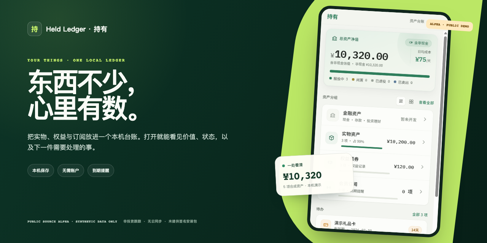
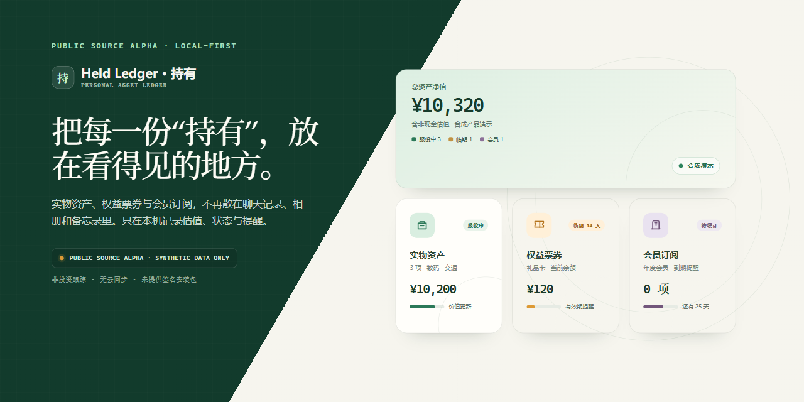
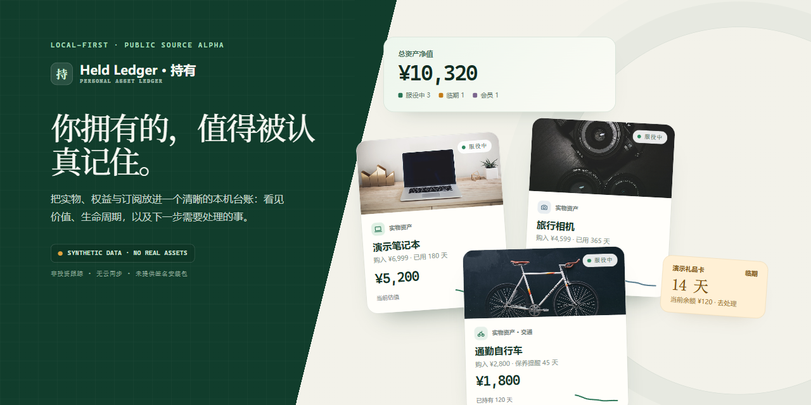

# Held Ledger 宣传图改进报告

## 结论

本轮改进完成并通过视觉检查。三张原始宣传图已保存在 `social/original/`，三张新版图继续使用原文件名，方便 README、Release 和社交分享直接替换。

新版不复制“有数”的具体界面，但吸收了它最有效的三点：高对比主视觉、产品内容直接成为画面主体，以及清晰的数据层级。Held Ledger 自己的识别点被收敛为“深森林绿 + 酸性青柠点缀 + 资产卡片 + 日均成本”。

| 交付项 | 结果 |
| --- | --- |
| 原始宣传图 | 3 张，已归档 |
| 当前宣传图 | 3 张，均为 `1280 × 640` |
| 可编辑源文件 | 3 个 HTML |
| 自动生成命令 | `npm run build:social-previews` |
| 数据边界 | 仅使用公开合成数据和公开素材 |

## 原来的宣传图与当前宣传图

### 1. 产品封面

| 原来的宣传图 | 当前宣传图 |
| --- | --- |
|  |  |

原图是浅色背景、衬线大标题和倾斜手机模型，信息完整但偏项目介绍。新版使用深色品牌面、粗体用户文案和高亮产品截图，让“东西不少，心里有数”与真实总览界面成为第一视觉。

### 2. 分类卡片总览

| 原来的宣传图 | 当前宣传图 |
| --- | --- |
|  |  |

原图采用等权重的小卡片阵列，接近功能说明页。新版将总资产净值变成高对比主卡，并用不对称布局区分实物资产、权益票券和会员订阅的权重。

### 3. 资产卡片主视觉

| 原来的宣传图 | 当前宣传图 |
| --- | --- |
|  |  |

原图已有实物照片，但卡片尺寸接近、产品卖点不够集中。新版让笔记本卡片成为主角，以相机、自行车和临期提醒组成辅助层级，并把 `¥ / 天`、持有天数和生命周期作为独有记忆点。

## 修改了哪些内容

### 视觉系统

- 将低对比浅色模板调整为深森林绿、暖纸色和酸性青柠的高对比组合。
- 中文标题从偏编辑感的衬线字体改为更有力量的粗体无衬线字体。
- 去掉网格、同权卡片和大面积装饰圆环，只保留能强化资产台账语义的结构。
- 所有重要数字使用等宽数字字体，形成稳定的“台账数据”气质。

### 构图与信息层级

- 产品封面直接放大公开合成数据截图，减少手机模型对产品内容的遮蔽。
- 分类图建立“总览主卡 > 实物资产 > 权益/会员”的明确层级。
- 资产卡片图采用一张大主卡、两张辅助卡和一个提醒标签，避免功能宫格式平均分配。
- Alpha、合成数据和功能边界保留在画面中，但降到页脚或小标签，不再抢占主卖点。

### 文案

- 主标题从技术或功能说明改为用户能立即理解的表达：`东西不少，心里有数。`
- 资产卡片图采用已确认文案：品牌 `持有 · 个人物品管理`，主标题 `给自己的物品建个档案`。移除副标题、英文眉题和重复的日均成本卖点框，让物品卡片说明功能。
- `BYOK`、`JSON`、签名状态等开发语言不再作为主宣传文案；真实边界仍在页脚完整保留。

### 可维护性

- 新增 `tools/capture-social-previews.mjs`，统一从三份 HTML 生成 PNG。
- 新增 `npm run build:social-previews`，任何设备都可以重复生成相同尺寸的宣传图。
- 原始 PNG 保存在 `social/original/`，方便继续比较和回退。

## 验证结果

- `npm run build:social-previews`：通过。
- 三张新版 PNG 均为 `1280 × 640`。
- 三张图均已实际渲染并目检；未发现文字重叠、裁切错误或资源加载失败。
- 新版只使用公开合成数据；资产照片来自本目录已记录来源的公开缩略图。
- 画面继续明确说明：Public Source Alpha、Synthetic Data Only、非投资跟踪、无云同步、未提供签名安装包。

## 可能的下一步建议

1. **补齐社交尺寸。** 从现有视觉系统派生 `1200 × 1200` 方图和 `1080 × 1440` 竖图，而不是简单裁切横图。
2. **让产品 UI 跟上宣传图。** 下一轮可把总览卡和资产卡的对比度、图片占比、数字层级向新版宣传图靠拢，减少“宣传图比产品本身更漂亮”的落差。
3. **沿用已确认的卡片文案。** 后续尺寸适配保留“给自己的物品建个档案”，避免重新加入口号和重复说明。
4. **替换品牌可见素材。** `gift-card.jpg` 中存在 Adidas 品牌，只适合调试上传流程；公开营销继续避免使用，或换成无品牌礼品卡图片。
5. **建立导出预设。** 后续在生成脚本里加入 GitHub Open Graph、公众号头图和小红书竖图预设，确保每个平台的文字安全区一致。
