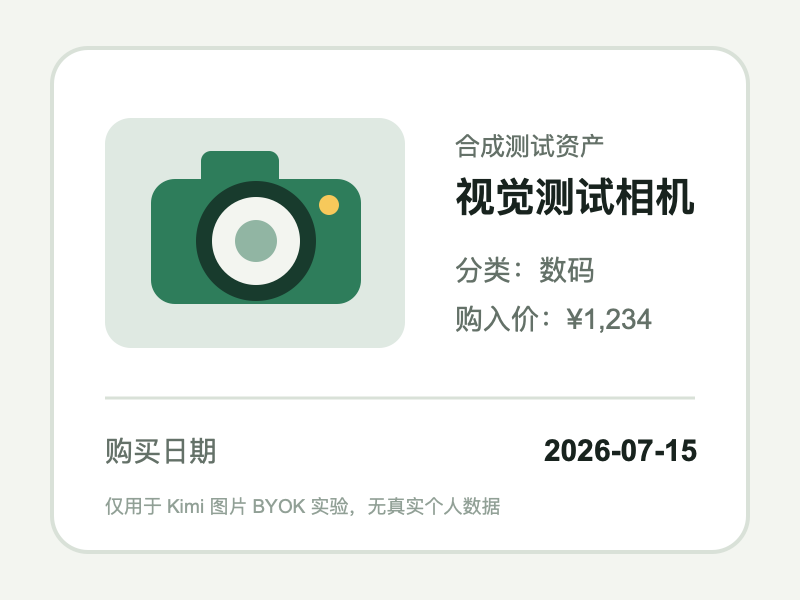
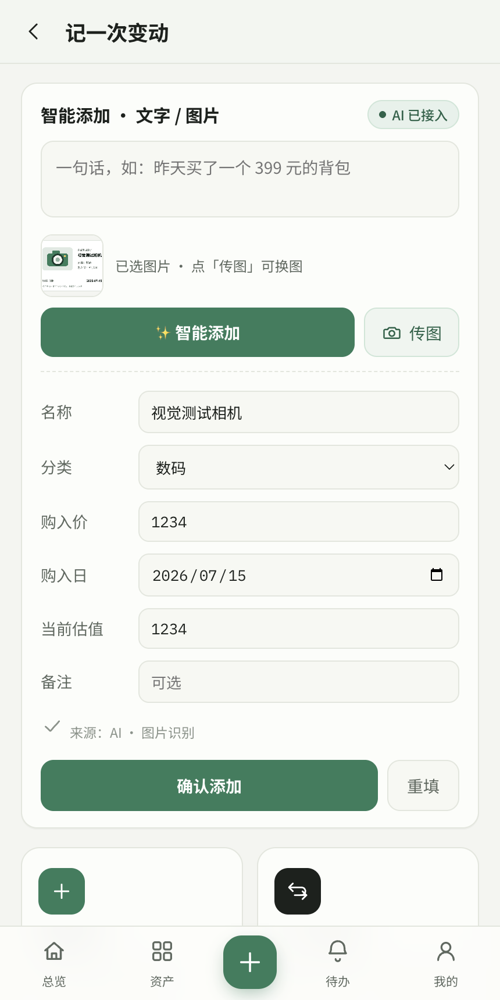

# Kimi Image BYOK Live Experiment Report

## Verdict

图片识别能力通过，产品持久化验收阻塞。

2026-07-15 使用现有 Kimi Coding BYOK token、当前可用模型 `kimi-for-coding` 和一张不含个人数据的合成 PNG，完成了真实图片请求。Kimi 返回 HTTP `200`，Held Ledger 正确显示：

- 名称：`视觉测试相机`
- 分类：`数码`
- 购入价：`1234`
- 购入日：`2026-07-15`
- 当前估值：`1234`
- 来源：`AI · 图片识别`

因此，“图片路径仍需 provider capability validation”已经完成，可以从 TODO 中勾除。

但点击“确认添加”后，隔离数据副本中已有资产使用 `nl1`，而当前 App 重启后 `nlSeq` 仍从 `1` 开始。新图片资产在内存和详情页出现，但 IndexedDB 最终保留了旧 `nl1` 记录。该问题不是 Kimi 图片识别失败，而是所有智能添加都可能遇到的 ID 持久化缺陷，应作为下一版发布前 P0。

## Safety Boundary

- 测试在真实用户数据目录的临时副本中执行，未修改原始 App 数据。
- 上传内容为仓库内新建的合成测试图片，不包含用户真实资产或个人信息。
- API key 只从本机 IndexedDB 临时读取，没有打印、写入仓库或报告。
- 测试完成后已关闭临时 Electron 进程。

## Provider and Request

| Field | Observed Value |
| --- | --- |
| Provider | Kimi Coding |
| Base URL | `https://api.kimi.com/coding/v1` |
| Stored model before test | `kimi-latest` in the original profile; left unchanged |
| Available models returned by `/models` | `kimi-for-coding`, `kimi-for-coding-highspeed` |
| Tested model | `kimi-for-coding`, selected only in the temporary profile copy |
| Request | `POST /chat/completions` |
| Image format | PNG as base64 `data:image/png;base64,...` inside `image_url` |
| HTTP result | `200` |
| Usage reported by provider | 814 prompt + 286 completion = 1100 tokens |

The official Kimi vision documentation also describes base64 `image_url` inside an array-valued user message as the supported request shape. Held Ledger already uses that shape in `demo/index.html`.

## Test Fixture

The fixture deliberately combines a simple camera illustration with exact structured fields, so OCR and asset extraction can be checked independently of personal data.

## Results

| Check | Result | Evidence |
| --- | --- | --- |
| Existing token authentication | Pass | `GET /models` returned `200` |
| Provider model discovery | Pass | Coding endpoint returned two current model IDs |
| Image request accepted | Pass | `POST /chat/completions` returned `200` |
| App request shape | Pass | `message.content` included text plus base64 `image_url` |
| Structured response parsing | Pass | JSON response became an editable preview |
| Name/category/price/date | Pass | All four fixture values matched exactly |
| Preview source label | Pass | UI displayed `来源：AI · 图片识别` |
| Immediate confirm/detail view | Pass | New asset appeared in in-memory asset detail |
| `photoSource` and image data in memory | Pass | `ai_input_upload`, PNG Data URL retained |
| IndexedDB persistence with existing `nl1` | Fail | Old `nl1` record overwrote the new in-memory `nl1` during bulk put |

## UI Evidence

The screenshot above is the real App preview after the live provider response. The immediate detail view was also captured at `reports/screenshots/kimi_image_byok_saved.png`, but it must not be treated as persistence proof because the IndexedDB check failed.

## Persistence Defect

The failure mechanism is deterministic:

1. `nlSeq` is initialized to `1` on every App launch.
2. A prior smart-added asset in the copied profile already has ID `nl1`.
3. The image confirmation creates another in-memory asset with ID `nl1`.
4. The in-memory array contains two `nl1` records: the new camera first and the older watch later.
5. `dbPutAll()` writes both with `put`; the later old record wins for the same key.
6. The UI appears successful until data is reloaded, while IndexedDB contains no `视觉测试相机` record.

Observed evidence:

| Location | `nl1` Record |
| --- | --- |
| In-memory array | `视觉测试相机` and one pre-existing `nl1` record both present |
| IndexedDB | Only the pre-existing `nl1` record remained; its user asset name is intentionally omitted |

## Acceptance Call

- Mark `Kimi Coding image BYOK live test` complete.
- To reproduce it in the real App profile, change the configured model from the old `kimi-latest` value to `kimi-for-coding` or another model returned by that endpoint.
- Do not claim stable or multi-provider image recognition.
- Add a P0 to generate collision-resistant asset IDs or initialize the sequence from existing records.
- Add a regression that starts with an existing `nl1`, restarts the App, confirms another smart-added asset, and verifies both records in IndexedDB.
- Until fixed, keep the release recommendation at local/isolated internal testing only and export JSON backups before relying on new smart-added records.
